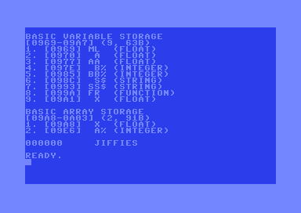

# C64 - Commodore Systems

## Preface
I’ve recently rekindled my interest in both assembly language programming and electronics. To explore these worlds, I’m looking for a retro-style system that can support both. Since the Commodore 64 Ultimate (C64U) is being released, the choice was easy. I never had a C64, so I’m excited about the challenges ahead. However, since it will be a while before I get the C64U, I’m hoping the C64 Mini is available in stores by December 2025. In the meantime, I might be able to tinker with that.

## Setup
1. Hardware
	- Waiting for the shipment (and delivery) of the C64U.
	- So for the time being emulation via VICE on a macOS
	
2. Primary System
	- macOS M2
	- VICE. [VICE](https://vice-emu.sourceforge.io)
	- ACME Assembler. [ACME](https://sourceforge.net/projects/acme-crossass/)
	- BBEdit. (macOS App Store)
	
3. Technical Sources
	- Reading, experimenting with trial and error.
	- Internet Archive. [ARCHIVE](https://archive.org)
	- Forums, etc.
	
4. Projects
	- (In-Progress) Project 01: Learn to use ACME, 6510 by means of dumping the BASIC storage areas.

a. Project01
	
	

	
## Notes
- Wow! forgot how much effort it takes to perform basic tasks in assembly language.
- Been spolit for decades with high-level languages.
